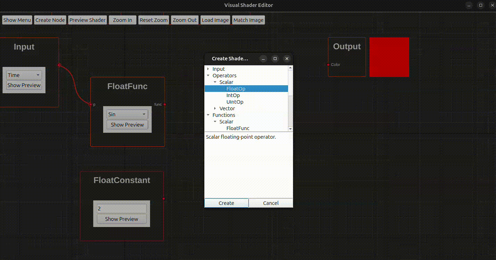
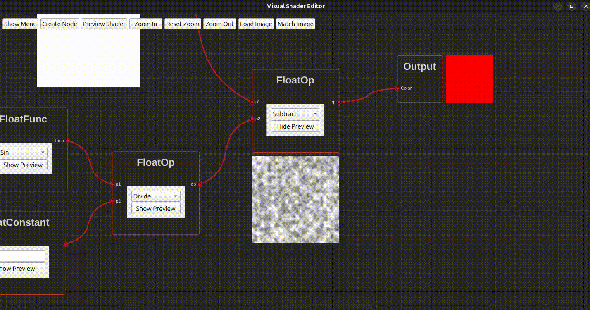

# ShaderGen

<table>
  <thead>
    <tr>
      <th>Architecture</th>
      <th>Build Status</th>
    </tr>
  </thead>
  <tbody>
    <tr>
      <td><strong>Ubuntu GCC 64-bit - Qt6</strong></td>
      <td></td>
    </tr>
    <tr>
      <td><strong>Windows GCC (MinGW64) - Qt6</strong></td>
      <td></td>
    </tr>
    <tr>
      <td><strong>Windows MSVC 64-bit - Qt6</strong></td>
      <td></td>
    </tr>
  </tbody>
</table>

Or mRGM, which stands for mini-RadialGM, is a simple and lightweight version of [RadialGM](https://github.com/enigma-dev/RadialGM). This is created as part of [my Google Summer of Code 2024 project](https://summerofcode.withgoogle.com/archive/2024/projects/wYTZuQbA) with ENIGMA, see also [absl-proto-grpc-ci](https://github.com/k0T0z/absl-proto-grpc-ci).

- Check my final report: https://docs.google.com/document/d/1ahKWo3m9fgqAfR9a3cqaIA08Sns05O68nhalpMNjDd8/edit?usp=sharing
- Check my post-final post my blog for more details: https://k0t0z.github.io/gsoc24-blog/blog/2024/10/13/after-google-summer-of-code-2024-google-protocol-buffers-technology.html

> [!NOTE]  
> You might be wondering when this will integrated into RGM, right? What? I can't hear you!

## Diffs from RadialGM

- Improved the integration of the Google Protocol Buffers. There are some features inside Google Protocol Buffers' API that are not used in RadialGM.
- Added a separate model for a oneof.
- Simplified primitives and repeated primitives.
- Created a great version of the FieldPath class.
- The `get_sub_model` method is now recieve an optional parameter `for_set_data` to get the sub-model for setting data.

## Steps To Add a New Node

1. Add the node in `gui/model/schema/visual_shader_nodes.proto`.
2. Add it inside `gui/controller/vs_proto_node.hpp`.
3. Add it inside the `VisualShaderEditor(MessageModel* model, QWidget* parent = nullptr)` in `gui/controller/visual_shader_editor.cpp`.
4. Create a generator for it.

## Acknowledgements

> [!NOTE]
> The way my ``Visual Shader Editor`` and ``Generator`` are written is inspired by [Godot](https://github.com/godotengine/godot) Game Engine. Check [Godot's LICENSE](https://github.com/godotengine/godot/blob/master/LICENSE.txt) for more info.
